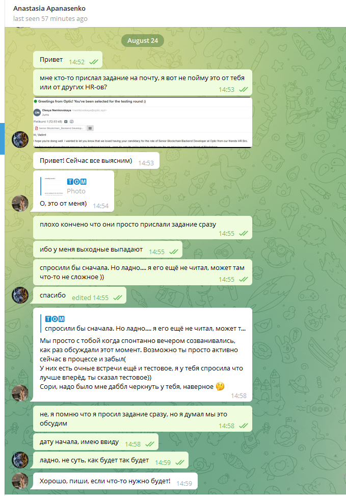
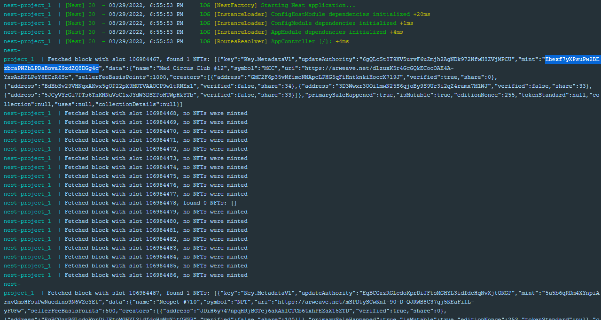

# NOTES

## Running application

- set slot from which to start fetching in .env file
- run docker-compose file
- check container stdout to see fetching results

P.S. currently first slot is chosen for the same NFT as in the task Ebexf7yXPsuPw2BEzbraPWZbLPDaBovaZ9zdZQ8DGg4c

## Mistake in the task description

In task example, there seems to be a mistake.

In task its written, that NFT Ebexf7yXPsuPw2BEzbraPWZbLPDaBovaZ9zdZQ8DGg4c was minted at block
131446497 (https://solscan.io/block/131446497)

But it was actually minted at 96294409 block height (at 106984467 slot)
https://explorer.solana.com/tx/5dsnZfEiuF37snLc2BE619ui1ceZv7UmA8wTsvHafEBy9bHHxz9NQpBPvxkaNnKLYqiewW85nVPpm9EGVQuMephP
getting data from RPC confirms this

## Implementation

### defined in task (current)

In task, it is defined to "fetch block by block and find all NFTs". So it was done this way -

The application takes transaction signatures from slot (first and last), then fetches Metaplex program signatures in
the rage of slot transactions (see code). Transaction signatures that matched Metaplex executed signatures means
Master edition account creation. Then we get fetch parsed versions of such transactions and identify NFT creation and
its Metaplex object.

### My thoughts on alternative solution (faster)

Above was done, because it was required in the task to fetch by block. In my opinion we could make it working much
faster by just fetching all neccessary transaction signatures directly from Metaplex account
> await this.solanaApi.getSignaturesForAddress(PROGRAM_ID)

using just LIMIT, not to overload RPC. This would help to safe time on processing blocks/transactions without NFT mint.

## Notes from my side:

- another moment I want to notify you about, is that I haven't worked with Solana before, so my approach of fetching
  NFTs from the blockchain might not be perfect or event correct. This application is the result of my investigation and
  analysis of Solana and Metaplex docs.
- as per solana web3 library, there is no possibility to fetch data by block, so I decided to use slot. Hopefuly its not
  critical for you, because seems there is only 1 block per slot.
- tests were not implemented because of lack of time (Actually I was able to code only 3.5 evenings, because was absent
  Friday-Sunday, I notified HR about these plans just after I received task  I can translate it if
  needed)

## Example of stdout

